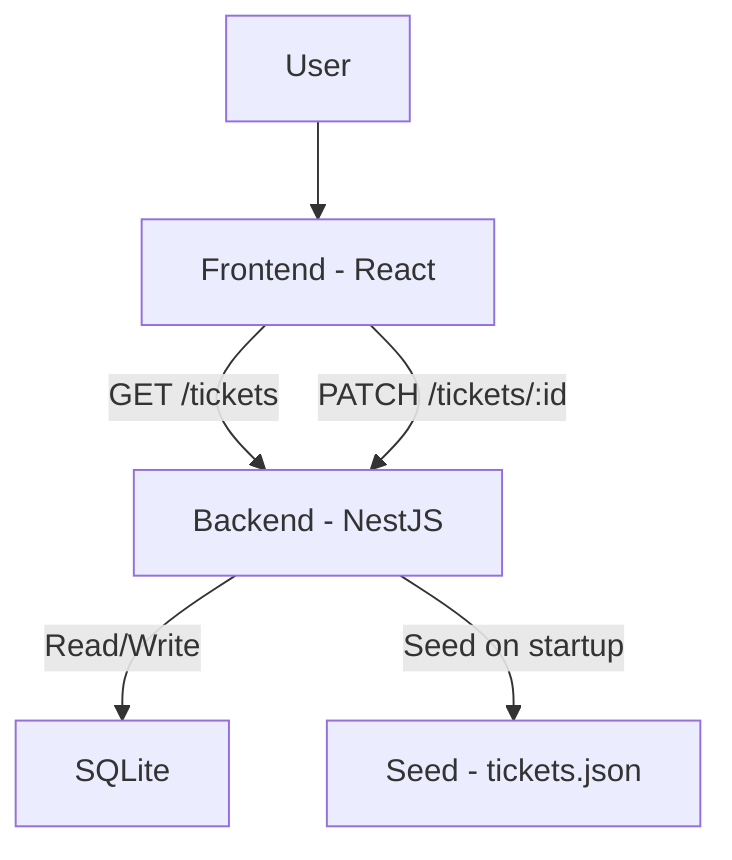

# Ticket Dashboard

Minimal full-stack ticket dashboard built as a technical assignment for Quack.

---

## Tech Stack

**Backend:**
- NestJS + TypeORM
- SQLite (via file storage)
- Seeded from local `tickets.json`

**Frontend:**
- React + TypeScript + Vite
- REST API calls via Axios

---

## Features

- 📄 Display support tickets with full details (ID, title, status, priority, created)
- 🔍 Filter tickets by status
- 📝 Change status from dropdown (updates persisted in DB)
- ⏳ Loading state + error handling
- 📅 Sort by creation date or priority

---

### System Architecture


---

## Project Structure

```
ticket-dashboard/
├── backend/       ← NestJS + SQLite
├── frontend/      ← React + Vite
├── tickets.json   ← used for initial DB seed
├── .gitignore     
└── README.md
```

---

## 🛠 Setup Instructions

### 1. Clone the repo

```bash

git clone https://github.com/your-username/ticket-dashboard.git
cd ticket-dashboard
```

### 2. Install dependencies

#### Backend
```bash

cd backend
npm install
```

#### Frontend
```bash

cd ../frontend
npm install
```

### 3. Run the application

#### Backend (NestJS + SQLite)
```bash

cd ../backend
npm run start:dev
```

This will:
- Create SQLite database `data.sqlite`
- Seed it from `tickets.json`

> App runs on: `http://localhost:3000`

#### Frontend (React + Vite)
```bash

cd ../frontend
npm run dev
```

> App runs on: `http://localhost:5173`

---

## 🧪 Endpoints

- `GET /tickets` — fetch all tickets (optionally `?status=open`)
- `PATCH /tickets/:id` — update ticket status

---

## 🧠 Notes

- SQLite is used as a lightweight local DB (per task instructions)
- JSON file is used **only for initial seeding**, not as live storage
- Cross-Origin enabled via `app.enableCors()` in backend
- Priority/status enums reused in frontend for consistency

---

## 👤 Author

**Vladimir Komov**  
💼 [linkedin.com/in/vladimirkomov](https://www.linkedin.com/in/vladkomov/)

---


